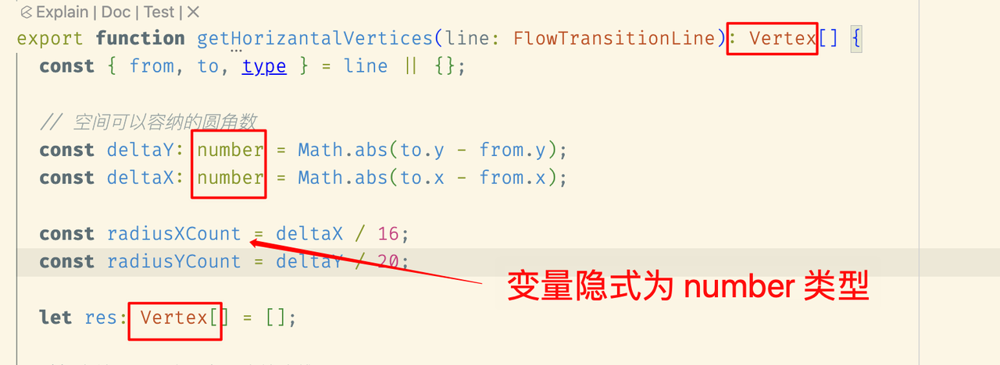

# Variable Engine

## Overall Design

### Architecture Layers

:::warning Architecture Layers
The variable engine design follows the DIP (Dependency Inversion Principle) and is divided into three layers based on code stability, abstraction level, and proximity to business:
- Variable Abstract Layer: The highest level of abstraction and most stable code in the variable architecture
- Variable Implementation Layer: The more volatile part of the variable architecture, typically requiring adjustments between different business needs
- Variable Business Layer: The Facade provided to business in the variable architecture, interacting with canvas engine and node engine
:::

### Terminology

#### 🌟 Scope
:::warning ⭐️⭐️⭐️ Definition:
A conventional space where variable declarations and consumption are described through AST
- Conventional space: The space is entirely defined by business
  - In low-code design state, it can be a node, a component, a right panel...
  - In code, it can be a Statement, a code block, a function, a file...
:::

What is the scope space? It can be defined by different businesses.

#### 🌟 Abstract Syntax Tree (AST)

:::warning Definition:
⭐️⭐️⭐️ A protocol that combines AST nodes in tree form to achieve explicit/implicit CRUD of variable information
- AST nodes: Reactive protocol nodes in AST
- Explicit CRUD, e.g.: Business explicitly sets a variable's type
- Implicit CRUD, e.g.: Business declares a variable, and its type is automatically inferred from initialization parameters
:::

:::warning Variables, types, expressions, structures, and other variable information in the scope are essentially combinations of AST nodes
- Variable -> VariableDeclaration node
- Expression -> Expression node
- Type -> TypeNode node
- Structure -> StructDeclaration node
:::

Reference link: https://ts-ast-viewer.com/

#### Variable

:::warning Definition:
An AST node used to declare new variables, using a unique identifier to point to a value that changes within a specific set range
- Value changing within a specific set range: The variable's value must be within the range described by the variable type
- Unique identifier: The variable must have a unique Key value
:::

[Variables in JavaScript, unique Key + pointing to a changing value](./assets/variable-code.png)

#### Variable Type

:::warning Definition:
⭐️⭐️⭐️ An AST node used to constrain a variable, where the constrained variable value can only change within a predetermined set range
- A variable can be bound to a variable type
:::

<table>
  <tr>
    <td></td>
    <td></td>
  </tr>
</table>

### Visual Understanding of the Variable Engine

:::warning Imagine a variable engine world like this:
- Define countries through individual scopes
- Each country contains three main citizens: declarations, types, and expressions
- Countries communicate with each other through scope chains
:::

