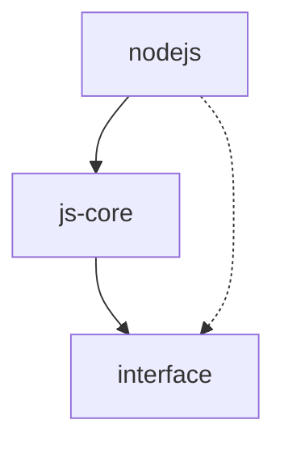

# FlowGram Runtime Source Code Guide

This document aims to help developers gain a deep understanding of FlowGram Runtime's source code structure and implementation details, providing guidance for customization and extension. Since FlowGram Runtime is positioned as a reference implementation rather than an SDK for direct use, understanding its internal implementation is particularly important for developers.

## Project Structure Overview

### Directory Structure

The FlowGram Runtime JS project has the following directory structure:

```
packages/runtime
├── js-core/          # Core runtime library
│   ├── src/
│   │   ├── application/    # Application layer, API implementation
│   │   ├── domain/         # Domain layer, core business logic
│   │   ├── infrastructure/ # Infrastructure layer, technical support
│   │   ├── nodes/          # Node executor implementations
│   │   └── index.ts        # Entry point
│   ├── package.json
│   └── tsconfig.json
├── interface/        # Interface definitions
│   ├── src/
│   │   ├── api/       # API interface definitions
│   │   ├── domain/    # Domain model interface definitions
│   │   ├── engine/    # Engine interface definitions
│   │   ├── node/      # Node interface definitions
│   │   └── index.ts   # Entry point
│   ├── package.json
│   └── tsconfig.json
└── nodejs/           # NodeJS service implementation
    ├── src/
    │   ├── api/       # HTTP API implementation
    │   ├── server/    # Server implementation
    │   └── index.ts   # Entry point
    ├── package.json
    └── tsconfig.json
```

### Module Organization

FlowGram Runtime JS employs a modular design, primarily divided into three core modules:

1. **interface**: Defines the system's interfaces and data structures, serving as the foundation for other modules
2. **js-core**: Implements the core functionality of the workflow engine, including workflow parsing, node execution, state management, etc.
3. **nodejs**: Provides an HTTP API service based on NodeJS, allowing the workflow engine to be called via HTTP interfaces

### Dependencies

The dependencies between modules are as follows:



- **interface** is the foundational module with no dependencies on other modules
- **js-core** depends on interfaces defined in the interface module
- **nodejs** depends on functionality provided by the js-core module, while also using interface definitions from the interface module

Key external dependencies include:

- **TypeScript**: Provides type safety and object-oriented programming support
- **LangChain**: Used for integrating large language models
- **OpenAI API**: Provides the default implementation for LLM nodes
- **fastify**: Used to implement HTTP API services
- **tRPC**: Used for type-safe API definitions and calls

## Core Module Analysis

### js-core Module

The js-core module is the core of FlowGram Runtime, implementing the main functionality of the workflow engine. This module adopts a Domain-Driven Design (DDD) architecture, divided into application, domain, and infrastructure layers.

#### Application Layer

The application layer is responsible for coordinating domain objects and implementing system use cases. Key files:

- `application/workflow.ts`: Workflow application service, implementing workflow validation, execution, cancellation, querying, etc.
- `application/api.ts`: API implementation, including TaskValidate, TaskRun, TaskResult, TaskReport, TaskCancel, etc.

#### Domain Layer

The domain layer contains core business logic and domain models. Key directories and files:

- `domain/engine/`: Workflow execution engine, responsible for workflow parsing and execution
  - `engine.ts`: Workflow engine implementation, containing core logic for node execution, state management, etc.
  - `validator.ts`: Workflow validator, checking the validity of workflow definitions
- `domain/document/`: Workflow document model, representing the structure of workflows
  - `workflow.ts`: Workflow definition model
  - `node.ts`: Node definition model
  - `edge.ts`: Edge definition model
- `domain/executor/`: Node executors, responsible for executing specific node logic
  - `executor.ts`: Node executor base class and factory
- `domain/variable/`: Variable management, handling variable storage and references in workflows
  - `manager.ts`: Variable manager, responsible for variable storage, retrieval, and parsing
  - `store.ts`: Variable storage, providing variable persistence
- `domain/status/`: Status management, tracking the execution status of workflows and nodes
  - `center.ts`: Status center, managing workflow and node statuses
- `domain/snapshot/`: Snapshot management, recording intermediate states of workflow execution
  - `center.ts`: Snapshot center, managing node execution snapshots
- `domain/report/`: Report generation, collecting detailed information on workflow execution
  - `center.ts`: Report center, generating workflow execution reports

#### Infrastructure Layer

The infrastructure layer provides technical support, including logging, events, containers, etc. Key files:

- `infrastructure/logger.ts`: Logging service, providing logging functionality
- `infrastructure/event.ts`: Event service, providing event publishing and subscription functionality
- `infrastructure/container.ts`: Dependency injection container, managing object creation and lifecycle
- `infrastructure/error.ts`: Error handling, defining error types and handling methods in the system

#### Node Executors

The nodes directory contains executor implementations for various node types. Key files:

- `nodes/start.ts`: Start node executor
- `nodes/end.ts`: End node executor
- `nodes/llm.ts`: LLM node executor, integrating large language models
- `nodes/condition.ts`: Condition node executor, implementing conditional branching
- `nodes/loop.ts`: Loop node executor, implementing loop logic

### interface Module

The interface module defines the system's interfaces and data structures, serving as the foundation for other modules. Key directories and files:

- `api/`: API interface definitions
  - `api.ts`: Defines the API interfaces provided by the system
  - `types.ts`: API-related data type definitions
- `domain/`: Domain model interface definitions
  - `document.ts`: Workflow document-related interfaces
  - `engine.ts`: Workflow engine-related interfaces
  - `executor.ts`: Node executor-related interfaces
  - `variable.ts`: Variable management-related interfaces
  - `status.ts`: Status management-related interfaces
  - `snapshot.ts`: Snapshot management-related interfaces
  - `report.ts`: Report generation-related interfaces
- `engine/`: Engine interface definitions
  - `types.ts`: Engine-related data type definitions
- `node/`: Node interface definitions
  - `types.ts`: Node-related data type definitions

### nodejs Module

The nodejs module provides an HTTP API service based on NodeJS, allowing the workflow engine to be called via HTTP interfaces. Key directories and files:

- `api/`: HTTP API implementation
  - `router.ts`: API route definitions
  - `handlers.ts`: API handler functions
- `server/`: Server implementation
  - `server.ts`: HTTP server implementation
  - `config.ts`: Server configuration

## Key Implementation Details

### Workflow Engine

The workflow engine is the core of FlowGram Runtime, responsible for workflow parsing and execution. Its main implementation is located in `js-core/src/domain/engine/engine.ts`.

The main functions of the workflow engine include:

1. **Workflow Parsing**: Converting workflow definitions into internal models
2. **Node Scheduling**: Determining the execution order of nodes based on edges defined in the workflow
3. **Node Execution**: Calling node executors to execute node logic
4. **State Management**: Tracking the execution status of workflows and nodes
5. **Variable Management**: Handling data transfer between nodes
6. **Error Handling**: Managing exceptions during execution

Key code snippet:

```typescript
// Core method for workflow execution
public async run(params: RunParams): Promise<RunResult> {
  const { schema, inputs, options } = params;

  // Create workflow context
  const context = this.createContext(schema, inputs, options);

  try {
    // Initialize workflow
    await this.initialize(context);

    // Execute workflow
    await this.execute(context);

    // Get workflow result
    const result = await this.getResult(context);

    return {
      status: 'success',
      outputs: result
    };
  } catch (error) {
    // Error handling
    return {
      status: 'fail',
      error: error.message
    };
  }
}

// Execute workflow
private async execute(context: IContext): Promise<void> {
  // Get start node
  const startNode = context.workflow.getStartNode();

  // Start execution from the start node
  await this.executeNode({ context, node: startNode });

  // Wait for all nodes to complete execution
  await this.waitForCompletion(context);
}

// Execute node
public async executeNode(params: { context: IContext; node: INode }): Promise<void> {
  const { context, node } = params;

  // Get node executor
  const executor = this.getExecutor(node.type);

  // Prepare node inputs
  const inputs = await this.prepareInputs(context, node);

  // Execute node
  const result = await executor.execute({
    node,
    inputs,
    context
  });

  // Process node outputs
  await this.processOutputs(context, node, result.outputs);

  // Schedule next nodes
  await this.scheduleNextNodes(context, node);
}
```

### Node Executors

Node executors are responsible for executing the specific logic of nodes. Each node type has a corresponding executor implementation located in the `js-core/src/nodes/` directory.

The basic interface for node executors is defined in `interface/src/domain/executor.ts`:

```typescript
export interface INodeExecutor {
  type: string;
  execute(context: ExecutionContext): Promise<ExecutionResult>;
}
```

Taking the LLM node executor as an example, its implementation is in `js-core/src/nodes/llm.ts`:

```typescript
export class LLMExecutor implements INodeExecutor {
  public type = 'llm';

  public async execute(context: ExecutionContext): Promise<ExecutionResult> {
    const inputs = context.inputs as LLMExecutorInputs;

    // Create LLM provider
    const provider = this.createProvider(inputs);

    // Prepare prompts
    const systemPrompt = inputs.systemPrompt || '';
    const userPrompt = inputs.prompt || '';

    // Call LLM
    const result = await provider.call({
      systemPrompt,
      userPrompt,
      options: {
        temperature: inputs.temperature
      }
    });

    // Return result
    return {
      outputs: {
        result: result.content
      }
    };
  }

  private createProvider(inputs: LLMExecutorInputs): ILLMProvider {
    // Create different providers based on model name
    if (inputs.modelName.startsWith('gpt-')) {
      return new OpenAIProvider({
        apiKey: inputs.apiKey,
        apiHost: inputs.apiHost,
        modelName: inputs.modelName
      });
    }

    throw new Error(`Unsupported model: ${inputs.modelName}`);
  }
}
```

### Variable Management

Variable management is an important part of workflow execution, responsible for handling data transfer between nodes. Its main implementation is in the `js-core/src/domain/variable/` directory.

The core of variable management is the variable manager and variable storage:

- **Variable Manager**: Responsible for parsing, getting, and setting variables
- **Variable Storage**: Provides persistent storage for variables

Key code snippet:

```typescript
// Variable manager
export class VariableManager implements IVariableManager {
  constructor(private store: IVariableStore) {}

  // Resolve variable references
  public async resolve(ref: ValueSchema, scope?: string): Promise<any> {
    if (ref.type === 'constant') {
      return ref.content;
    } else if (ref.type === 'ref') {
      const path = ref.content as string[];
      return this.get(path, scope);
    }
    throw new Error(`Unsupported value type: ${ref.type}`);
  }

  // Get variable value
  public async get(path: string[], scope?: string): Promise<any> {
    const [nodeID, key, ...rest] = path;
    const value = await this.store.get(nodeID, key, scope);

    if (rest.length === 0) {
      return value;
    }

    // Handle nested properties
    return this.getNestedProperty(value, rest);
  }

  // Set variable value
  public async set(nodeID: string, key: string, value: any, scope?: string): Promise<void> {
    await this.store.set(nodeID, key, value, scope);
  }
}
```

### State Storage

State storage is responsible for managing the execution state of workflows and nodes. Its main implementation is in the `js-core/src/domain/status/` and `js-core/src/domain/snapshot/` directories.

The core components of state management include:

- **Status Center**: Manages the status of workflows and nodes
- **Snapshot Center**: Records snapshots of node execution
- **Report Center**: Generates workflow execution reports

Key code snippet:

```typescript
// Status center
export class StatusCenter implements IStatusCenter {
  private workflowStatus: Record<string, WorkflowStatus> = {};
  private nodeStatus: Record<string, Record<string, NodeStatus>> = {};

  // Set workflow status
  public setWorkflowStatus(workflowID: string, status: WorkflowStatus): void {
    this.workflowStatus[workflowID] = status;
  }

  // Get workflow status
  public getWorkflowStatus(workflowID: string): WorkflowStatus {
    return this.workflowStatus[workflowID] || 'idle';
  }

  // Set node status
  public setNodeStatus(workflowID: string, nodeID: string, status: NodeStatus): void {
    if (!this.nodeStatus[workflowID]) {
      this.nodeStatus[workflowID] = {};
    }
    this.nodeStatus[workflowID][nodeID] = status;
  }

  // Get node status
  public getNodeStatus(workflowID: string, nodeID: string): NodeStatus {
    return this.nodeStatus[workflowID]?.[nodeID] || 'idle';
  }
}
```

## Design Patterns and Architectural Decisions

### Domain-Driven Design

FlowGram Runtime adopts a Domain-Driven Design (DDD) architecture, dividing the system into application, domain, and infrastructure layers. This architecture helps separate concerns, making the code more modular and maintainable.

Key domain concepts include:

- **Workflow**: Represents a complete workflow definition
- **Node**: Basic execution unit in a workflow
- **Edge**: Line connecting nodes, representing execution flow
- **Execution Context**: Environment for workflow execution
- **Variable**: Data in the workflow execution process

### Factory Pattern

FlowGram Runtime uses the Factory pattern to create node executors, enabling the system to dynamically create corresponding executors based on node types.

```typescript
// Node executor factory
export class NodeExecutorFactory implements INodeExecutorFactory {
  private executors: Record<string, INodeExecutor> = {};

  // Register node executor
  public register(executor: INodeExecutor): void {
    this.executors[executor.type] = executor;
  }

  // Create node executor
  public create(type: string): INodeExecutor {
    const executor = this.executors[type];
    if (!executor) {
      throw new Error(`No executor registered for node type: ${type}`);
    }
    return executor;
  }
}
```

### Strategy Pattern

FlowGram Runtime uses the Strategy pattern to handle execution logic for different types of nodes, with each node type having a corresponding execution strategy.

```typescript
// Node executor interface (strategy interface)
export interface INodeExecutor {
  type: string;
  execute(context: ExecutionContext): Promise<ExecutionResult>;
}

// Concrete strategy implementation
export class StartExecutor implements INodeExecutor {
  public type = 'start';

  public async execute(context: ExecutionContext): Promise<ExecutionResult> {
    // Start node execution logic
  }
}

export class EndExecutor implements INodeExecutor {
  public type = 'end';

  public async execute(context: ExecutionContext): Promise<ExecutionResult> {
    // End node execution logic
  }
}
```

### Observer Pattern

FlowGram Runtime uses the Observer pattern to implement the event system, allowing components to publish and subscribe to events.

```typescript
// Event emitter
export class EventEmitter implements IEventEmitter {
  private listeners: Record<string, Function[]> = {};

  // Subscribe to event
  public on(event: string, listener: Function): void {
    if (!this.listeners[event]) {
      this.listeners[event] = [];
    }
    this.listeners[event].push(listener);
  }

  // Publish event
  public emit(event: string, ...args: any[]): void {
    const eventListeners = this.listeners[event];
    if (eventListeners) {
      for (const listener of eventListeners) {
        listener(...args);
      }
    }
  }
}
```

### Dependency Injection

FlowGram Runtime uses Dependency Injection to manage dependencies between components, making components more loosely coupled and testable.

```typescript
// Dependency injection container
export class Container {
  private static _instance: Container;
  private registry: Map<any, any> = new Map();

  public static get instance(): Container {
    if (!Container._instance) {
      Container._instance = new Container();
    }
    return Container._instance;
  }

  // Register service
  public register<T>(token: any, instance: T): void {
    this.registry.set(token, instance);
  }

  // Get service
  public resolve<T>(token: any): T {
    const instance = this.registry.get(token);
    if (!instance) {
      throw new Error(`No instance registered for token: ${token}`);
    }
    return instance;
  }
}
```
