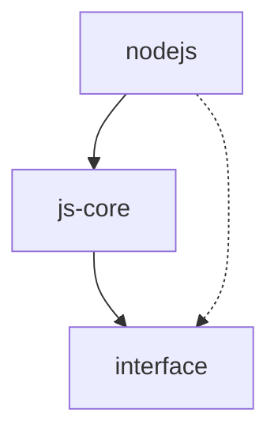

# FlowGram Runtime 源码导读

本文档旨在帮助开发者深入理解 FlowGram Runtime 的源码结构和实现细节，为后续的定制开发提供指导。由于 FlowGram Runtime 定位为参考实现而非直接使用的 SDK，因此了解其内部实现对于开发者来说尤为重要。

## 项目结构概述

### 目录结构

FlowGram Runtime JS 项目的目录结构如下：

```
packages/runtime
├── js-core/          # 核心运行时库
│   ├── src/
│   │   ├── application/    # 应用层，实现API接口
│   │   ├── domain/         # 领域层，核心业务逻辑
│   │   ├── infrastructure/ # 基础设施层，提供技术支持
│   │   ├── nodes/          # 节点执行器实现
│   │   └── index.ts        # 入口文件
│   ├── package.json
│   └── tsconfig.json
├── interface/        # 接口定义
│   ├── src/
│   │   ├── api/       # API接口定义
│   │   ├── domain/    # 领域模型接口定义
│   │   ├── engine/    # 引擎接口定义
│   │   ├── node/      # 节点接口定义
│   │   └── index.ts   # 入口文件
│   ├── package.json
│   └── tsconfig.json
└── nodejs/           # NodeJS 服务实现
    ├── src/
    │   ├── api/       # HTTP API实现
    │   ├── server/    # 服务器实现
    │   └── index.ts   # 入口文件
    ├── package.json
    └── tsconfig.json
```

### 模块组织

FlowGram Runtime JS 采用模块化设计，主要分为三个核心模块：

1. **interface**: 定义了系统的接口和数据结构，是其他模块的基础
2. **js-core**: 实现了工作流引擎的核心功能，包括工作流解析、节点执行、状态管理等
3. **nodejs**: 提供了基于 NodeJS 的 HTTP API 服务，使工作流引擎可以通过 HTTP 接口调用

### 依赖关系

模块之间的依赖关系如下：



- **interface** 是基础模块，不依赖其他模块
- **js-core** 依赖 interface 模块中定义的接口
- **nodejs** 依赖 js-core 模块提供的功能，同时也使用 interface 模块中的接口定义

主要的外部依赖包括：

- **TypeScript**: 提供类型安全和面向对象编程支持
- **LangChain**: 用于集成大型语言模型
- **OpenAI API**: 提供 LLM 节点的默认实现
- **fastify**: 用于实现 HTTP API 服务
- **tRPC**: 用于类型安全的 API 定义和调用

## 核心模块详解

### js-core 模块

js-core 模块是 FlowGram Runtime 的核心，实现了工作流引擎的主要功能。该模块采用领域驱动设计（DDD）架构，分为应用层、领域层和基础设施层。

#### 应用层 (application)

应用层负责协调领域对象，实现系统的用例。主要文件：

- `application/workflow.ts`: 工作流应用服务，实现工作流的验证、执行、取消、查询等功能
- `application/api.ts`: API 实现，包括 TaskValidate、TaskRun、TaskResult、TaskReport、TaskCancel 等

#### 领域层 (domain)

领域层包含业务核心逻辑和领域模型。主要目录和文件：

- `domain/engine/`: 工作流执行引擎，负责工作流的解析和执行
  - `engine.ts`: 工作流引擎实现，包含节点执行、状态管理等核心逻辑
  - `validator.ts`: 工作流验证器，检查工作流定义的有效性
- `domain/document/`: 工作流文档模型，表示工作流的结构
  - `workflow.ts`: 工作流定义模型
  - `node.ts`: 节点定义模型
  - `edge.ts`: 边定义模型
- `domain/executor/`: 节点执行器，负责执行具体节点的逻辑
  - `executor.ts`: 节点执行器基类和工厂
- `domain/variable/`: 变量管理，处理工作流中的变量存储和引用
  - `manager.ts`: 变量管理器，负责变量的存储、获取和解析
  - `store.ts`: 变量存储，提供变量的持久化
- `domain/status/`: 状态管理，跟踪工作流和节点的执行状态
  - `center.ts`: 状态中心，管理工作流和节点的状态
- `domain/snapshot/`: 快照管理，记录工作流执行的中间状态
  - `center.ts`: 快照中心，管理节点执行的快照
- `domain/report/`: 报告生成，收集工作流执行的详细信息
  - `center.ts`: 报告中心，生成工作流执行报告

#### 基础设施层 (infrastructure)

基础设施层提供技术支持，包括日志、事件、容器等。主要文件：

- `infrastructure/logger.ts`: 日志服务，提供日志记录功能
- `infrastructure/event.ts`: 事件服务，提供事件发布和订阅功能
- `infrastructure/container.ts`: 依赖注入容器，管理对象的创建和生命周期
- `infrastructure/error.ts`: 错误处理，定义系统中的错误类型和处理方式

#### 节点执行器 (nodes)

nodes 目录包含各种节点类型的执行器实现。主要文件：

- `nodes/start.ts`: Start 节点执行器
- `nodes/end.ts`: End 节点执行器
- `nodes/llm.ts`: LLM 节点执行器，集成大型语言模型
- `nodes/condition.ts`: Condition 节点执行器，实现条件分支
- `nodes/loop.ts`: Loop 节点执行器，实现循环逻辑

### interface 模块

interface 模块定义了系统的接口和数据结构，是其他模块的基础。主要目录和文件：

- `api/`: API 接口定义
  - `api.ts`: 定义系统提供的 API 接口
  - `types.ts`: API 相关的数据类型定义
- `domain/`: 领域模型接口定义
  - `document.ts`: 工作流文档相关接口
  - `engine.ts`: 工作流引擎相关接口
  - `executor.ts`: 节点执行器相关接口
  - `variable.ts`: 变量管理相关接口
  - `status.ts`: 状态管理相关接口
  - `snapshot.ts`: 快照管理相关接口
  - `report.ts`: 报告生成相关接口
- `engine/`: 引擎接口定义
  - `types.ts`: 引擎相关的数据类型定义
- `node/`: 节点接口定义
  - `types.ts`: 节点相关的数据类型定义

### nodejs 模块

nodejs 模块提供了基于 NodeJS 的 HTTP API 服务，使工作流引擎可以通过 HTTP 接口调用。主要目录和文件：

- `api/`: HTTP API 实现
  - `router.ts`: API 路由定义
  - `handlers.ts`: API 处理函数
- `server/`: 服务器实现
  - `server.ts`: HTTP 服务器实现
  - `config.ts`: 服务器配置

## 关键实现分析

### 工作流引擎

工作流引擎是 FlowGram Runtime 的核心，负责工作流的解析和执行。其主要实现位于 `js-core/src/domain/engine/engine.ts`。

工作流引擎的主要功能包括：

1. **工作流解析**：将工作流定义转换为内部模型
2. **节点调度**：根据工作流定义的边，确定节点的执行顺序
3. **节点执行**：调用节点执行器执行节点逻辑
4. **状态管理**：跟踪工作流和节点的执行状态
5. **变量管理**：处理节点间的数据传递
6. **错误处理**：处理执行过程中的异常情况

关键代码片段：

```typescript
// 工作流执行的核心方法
public async run(params: RunParams): Promise<RunResult> {
  const { schema, inputs, options } = params;

  // 创建工作流上下文
  const context = this.createContext(schema, inputs, options);

  try {
    // 初始化工作流
    await this.initialize(context);

    // 执行工作流
    await this.execute(context);

    // 获取工作流结果
    const result = await this.getResult(context);

    return {
      status: 'success',
      outputs: result
    };
  } catch (error) {
    // 错误处理
    return {
      status: 'fail',
      error: error.message
    };
  }
}

// 执行工作流
private async execute(context: IContext): Promise<void> {
  // 获取开始节点
  const startNode = context.workflow.getStartNode();

  // 从开始节点开始执行
  await this.executeNode({ context, node: startNode });

  // 等待所有节点执行完成
  await this.waitForCompletion(context);
}

// 执行节点
public async executeNode(params: { context: IContext; node: INode }): Promise<void> {
  const { context, node } = params;

  // 获取节点执行器
  const executor = this.getExecutor(node.type);

  // 准备节点输入
  const inputs = await this.prepareInputs(context, node);

  // 执行节点
  const result = await executor.execute({
    node,
    inputs,
    context
  });

  // 处理节点输出
  await this.processOutputs(context, node, result.outputs);

  // 调度下一个节点
  await this.scheduleNextNodes(context, node);
}
```

### 节点执行器

节点执行器负责执行具体节点的逻辑。每种节点类型都有对应的执行器实现，位于 `js-core/src/nodes/` 目录。

节点执行器的基本接口定义在 `interface/src/domain/executor.ts` 中：

```typescript
export interface INodeExecutor {
  type: string;
  execute(context: ExecutionContext): Promise<ExecutionResult>;
}
```

以 LLM 节点执行器为例，其实现位于 `js-core/src/nodes/llm.ts`：

```typescript
export class LLMExecutor implements INodeExecutor {
  public type = 'llm';

  public async execute(context: ExecutionContext): Promise<ExecutionResult> {
    const inputs = context.inputs as LLMExecutorInputs;

    // 创建 LLM 提供商
    const provider = this.createProvider(inputs);

    // 准备提示词
    const systemPrompt = inputs.systemPrompt || '';
    const userPrompt = inputs.prompt || '';

    // 调用 LLM
    const result = await provider.call({
      systemPrompt,
      userPrompt,
      options: {
        temperature: inputs.temperature
      }
    });

    // 返回结果
    return {
      outputs: {
        result: result.content
      }
    };
  }

  private createProvider(inputs: LLMExecutorInputs): ILLMProvider {
    // 根据模型名称创建不同的提供商
    if (inputs.modelName.startsWith('gpt-')) {
      return new OpenAIProvider({
        apiKey: inputs.apiKey,
        apiHost: inputs.apiHost,
        modelName: inputs.modelName
      });
    }

    throw new Error(`Unsupported model: ${inputs.modelName}`);
  }
}
```

### 变量管理

变量管理是工作流执行的重要部分，负责处理节点间的数据传递。其主要实现位于 `js-core/src/domain/variable/` 目录。

变量管理的核心是变量管理器和变量存储：

- **变量管理器**：负责变量的解析、获取和设置
- **变量存储**：提供变量的持久化存储

关键代码片段：

```typescript
// 变量管理器
export class VariableManager implements IVariableManager {
  constructor(private store: IVariableStore) {}

  // 解析变量引用
  public async resolve(ref: ValueSchema, scope?: string): Promise<any> {
    if (ref.type === 'constant') {
      return ref.content;
    } else if (ref.type === 'ref') {
      const path = ref.content as string[];
      return this.get(path, scope);
    }
    throw new Error(`Unsupported value type: ${ref.type}`);
  }

  // 获取变量值
  public async get(path: string[], scope?: string): Promise<any> {
    const [nodeID, key, ...rest] = path;
    const value = await this.store.get(nodeID, key, scope);

    if (rest.length === 0) {
      return value;
    }

    // 处理嵌套属性
    return this.getNestedProperty(value, rest);
  }

  // 设置变量值
  public async set(nodeID: string, key: string, value: any, scope?: string): Promise<void> {
    await this.store.set(nodeID, key, value, scope);
  }
}
```

### 状态存储

状态存储负责管理工作流和节点的执行状态。其主要实现位于 `js-core/src/domain/status/` 和 `js-core/src/domain/snapshot/` 目录。

状态管理的核心组件包括：

- **状态中心**：管理工作流和节点的状态
- **快照中心**：记录节点执行的快照
- **报告中心**：生成工作流执行报告

关键代码片段：

```typescript
// 状态中心
export class StatusCenter implements IStatusCenter {
  private workflowStatus: Record<string, WorkflowStatus> = {};
  private nodeStatus: Record<string, Record<string, NodeStatus>> = {};

  // 设置工作流状态
  public setWorkflowStatus(workflowID: string, status: WorkflowStatus): void {
    this.workflowStatus[workflowID] = status;
  }

  // 获取工作流状态
  public getWorkflowStatus(workflowID: string): WorkflowStatus {
    return this.workflowStatus[workflowID] || 'idle';
  }

  // 设置节点状态
  public setNodeStatus(workflowID: string, nodeID: string, status: NodeStatus): void {
    if (!this.nodeStatus[workflowID]) {
      this.nodeStatus[workflowID] = {};
    }
    this.nodeStatus[workflowID][nodeID] = status;
  }

  // 获取节点状态
  public getNodeStatus(workflowID: string, nodeID: string): NodeStatus {
    return this.nodeStatus[workflowID]?.[nodeID] || 'idle';
  }
}
```

## 设计模式和架构决策

### 领域驱动设计

FlowGram Runtime 采用领域驱动设计（DDD）架构，将系统分为应用层、领域层和基础设施层。这种架构有助于分离关注点，使代码更加模块化和可维护。

主要的领域概念包括：

- **工作流**：表示一个完整的工作流定义
- **节点**：工作流中的基本执行单元
- **边**：连接节点的线，表示执行流程
- **执行上下文**：工作流执行的环境
- **变量**：工作流执行过程中的数据

### 工厂模式

FlowGram Runtime 使用工厂模式创建节点执行器，使系统能够根据节点类型动态创建对应的执行器。

```typescript
// 节点执行器工厂
export class NodeExecutorFactory implements INodeExecutorFactory {
  private executors: Record<string, INodeExecutor> = {};

  // 注册节点执行器
  public register(executor: INodeExecutor): void {
    this.executors[executor.type] = executor;
  }

  // 创建节点执行器
  public create(type: string): INodeExecutor {
    const executor = this.executors[type];
    if (!executor) {
      throw new Error(`No executor registered for node type: ${type}`);
    }
    return executor;
  }
}
```

### 策略模式

FlowGram Runtime 使用策略模式处理不同类型的节点执行逻辑，每种节点类型都有对应的执行策略。

```typescript
// 节点执行器接口（策略接口）
export interface INodeExecutor {
  type: string;
  execute(context: ExecutionContext): Promise<ExecutionResult>;
}

// 具体策略实现
export class StartExecutor implements INodeExecutor {
  public type = 'start';

  public async execute(context: ExecutionContext): Promise<ExecutionResult> {
    // Start 节点的执行逻辑
  }
}

export class EndExecutor implements INodeExecutor {
  public type = 'end';

  public async execute(context: ExecutionContext): Promise<ExecutionResult> {
    // End 节点的执行逻辑
  }
}
```

### 观察者模式

FlowGram Runtime 使用观察者模式实现事件系统，使组件能够发布和订阅事件。

```typescript
// 事件发布者
export class EventEmitter implements IEventEmitter {
  private listeners: Record<string, Function[]> = {};

  // 订阅事件
  public on(event: string, listener: Function): void {
    if (!this.listeners[event]) {
      this.listeners[event] = [];
    }
    this.listeners[event].push(listener);
  }

  // 发布事件
  public emit(event: string, ...args: any[]): void {
    const eventListeners = this.listeners[event];
    if (eventListeners) {
      for (const listener of eventListeners) {
        listener(...args);
      }
    }
  }
}
```

### 依赖注入

FlowGram Runtime 使用依赖注入管理组件之间的依赖关系，使组件更加松耦合和可测试。

```typescript
// 依赖注入容器
export class Container {
  private static _instance: Container;
  private registry: Map<any, any> = new Map();

  public static get instance(): Container {
    if (!Container._instance) {
      Container._instance = new Container();
    }
    return Container._instance;
  }

  // 注册服务
  public register<T>(token: any, instance: T): void {
    this.registry.set(token, instance);
  }

  // 获取服务
  public resolve<T>(token: any): T {
    const instance = this.registry.get(token);
    if (!instance) {
      throw new Error(`No instance registered for token: ${token}`);
    }
    return instance;
  }
}
```
