# InjectMaterial Component

A material component wrapper with dependency injection support for implementing dynamic component replacement mechanisms.

## Why Dependency Injection Matters

### ❌ Tight Coupling: Traditional Dependency Issues

```mermaid
graph TD
    A[Material A] --> B[Material B]
    B --> D[Material D]
    C[Material C] --> D

    style D fill:#ff4757
    style A fill:#ffa502
    style B fill:#ffa502
    style C fill:#ffa502

    note["💥 Problem: D changes require modifications to A, B, C"]
```



**Issues:** Chain reactions, high maintenance costs

### ✅ Decoupling: Dependency Injection Solution


**Benefits:** Hot-swapping, parallel development, version compatibility

## Features

- 🔧 **Dependency Injection**: Support dynamic component replacement via FlowRendererRegistry
- 🔄 **Smart Fallback**: Automatically use default component when no custom component is registered
- 🎯 **Type Safety**: Full TypeScript type inference support
- 📦 **Zero Configuration**: Works out of the box without additional setup

## Usage

### 1. Create Injectable Material Component

```tsx
import { createInjectMaterial } from '@flowgram.ai/form-materials';
import { VariableSelector } from './VariableSelector';

// Create injectable material wrapper component
const InjectVariableSelector = createInjectMaterial(VariableSelector);

// Now you can use it like a regular component
function MyComponent() {
  return <InjectVariableSelector value={value} onChange={handleChange} />;
}
```

### 2. Register Custom Components

Configure custom renderer in `use-editor-props.tsx`:

```tsx
import { useEditorProps } from '@flowgram.ai/editor';
import { YourCustomVariableSelector } from './YourCustomVariableSelector';
import { VariableSelector } from '@flowgram.ai/form-materials';

function useCustomEditorProps() {
  const editorProps = useEditorProps({
    materials: {
      components: {
        // Use component's renderKey or component name as key
        [VariableSelector.renderKey]: YourCustomVariableSelector,
        [TypeSelector.renderKey]: YourCustomTypeSelector,
      }
    }
  });

  return editorProps;
}
```

### 3. Use Custom renderKey

If your component requires a specific renderKey:

```tsx
const InjectCustomComponent = createInjectMaterial(MyComponent, {
  renderKey: 'my-custom-key'
});

// When registering
{
  materials: {
    components: {
      'my-custom-key': MyCustomRenderer
    }
  }
}
```

## Sequence Diagram

Complete component registration and rendering sequence diagram:


## Render Key Priority

Component render key determination follows this priority order:

1. `params.renderKey` (second parameter of createInjectMaterial)
2. `Component.renderKey` (component's own renderKey property)
3. `Component.name` (component's display name)
4. Empty string (final fallback)

## Type Definition

```typescript
interface CreateInjectMaterialOptions {
  renderKey?: string;
}

function createInjectMaterial<Props>(
  Component: React.FC<Props> & { renderKey?: string },
  params?: CreateInjectMaterialOptions
): React.FC<Props>
```
